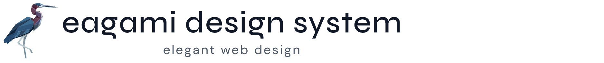

<p align="center">
  
</p>

<p align="center">
  <a href="https://www.npmjs.com/package/@eagami/ui"></a>
  <a href="https://github.com/mwiraszka/eagami-design-system/actions/workflows/ci.yml"></a>
  <a href="https://github.com/mwiraszka/eagami-design-system/blob/main/LICENSE"></a>
</p>

A lightweight, accessible Angular component library built on CSS custom properties, with portable design system integration guides for Flutter and React ([see more](#framework-integration)). Ready to use out of the box — install, import, and start building.

Every component is standalone, signal-based, and fully themed via design tokens. No wrapping modules, no complex setup, no runtime style conflicts. Designed to be AI-friendly with clear APIs, consistent patterns, and comprehensive documentation that makes it easy for both developers and AI assistants to work with.

**Component reference and live examples:** [eagami.com/ui](https://eagami.com/ui)

## Features

- **Zero configuration** — works immediately after install with sensible defaults
- **Standalone components** — no `NgModule` boilerplate, just import and use
- **Signal-based** — built on Angular's modern reactivity primitives (`input()`, `model()`, `output()`, `effect()`)
- **Full theming via CSS custom properties** — override any design token on `:root` or scope overrides to individual components
- **Dark mode built in** — automatic via `prefers-color-scheme`, no extra setup
- **Accessible** — ARIA attributes, keyboard navigation, focus management, and screen reader support throughout
- **Form-ready** — `ControlValueAccessor` on every form control (input, textarea, checkbox, switch, radio, dropdown, autocomplete, date picker, slider, code input, segmented)
- **Tree-shakeable** — only the components you import end up in your bundle
- **Tiny** — the entire library is **70 KB gzipped**, and only the components you import end up in your bundle

## Installation

```bash
npm install @eagami/ui
# or
pnpm add @eagami/ui
```

Add the global stylesheet to your `angular.json` (or import it in your root SCSS):

```json
"styles": ["node_modules/@eagami/ui/src/styles/eagami-ui.scss"]
```

Load the fonts in your `index.html`:

```html
<link rel="preconnect" href="https://fonts.googleapis.com" />
<link rel="preconnect" href="https://fonts.gstatic.com" crossorigin />
<link rel="stylesheet" href="https://fonts.googleapis.com/css2?family=DM+Sans:ital,opsz,wght@0,9..40,300;0,9..40,400;0,9..40,500;0,9..40,600;1,9..40,400&family=Syne:wght@400;500;600;700&display=swap" />
```

## Quick start

```typescript
import { ButtonComponent } from '@eagami/ui';

@Component({
  imports: [ButtonComponent],
  template: `<ea-button variant="primary" (clicked)="save()">Save</ea-button>`,
})
export class MyComponent {
  save() { /* ... */ }
}
```

No modules to register, no providers to configure. Every component works the same way — import it, drop it in your template.

> **Upgrading from v0.x?** See [MIGRATION.md](MIGRATION.md) for the full list of breaking changes and a find/replace table that covers most upgrades in one pass.

## What's included

- **Form controls** — Input, Textarea, Checkbox, Switch, Radio, Dropdown, Autocomplete, Date picker, Slider, Code input, Segmented
- **Overlays** — Dialog, Drawer, Tooltip, Menu, Toast
- **Navigation** — Tabs, Breadcrumbs, Paginator, Accordion
- **Display** — Card, Badge, Tag, Alert, Avatar, Skeleton, Spinner, Progress bar, Empty state, Divider, Eagami wordmark
- **Data** — Data table
- **Specialised** — Avatar editor
- **Icons** — 52 stroke-based SVG icon components (`<ea-icon-*>`)

Full per-component documentation — props, events, examples, and accessibility notes — lives at **[eagami.com/ui](https://eagami.com/ui)**.

## Theming

All visual properties are controlled through CSS custom properties defined on `:root`. Override any token to customise the entire library:

```css
:root {
  --color-primary-600: #2563eb;
  --font-family-sans: 'Inter', sans-serif;
  --radius-md: 0.5rem;
}
```

Component-level overrides are available where useful:

```css
.my-card {
  --ea-card-shadow: 0 8px 32px rgba(0, 0, 0, 0.12);
  --ea-button-font-weight: 600;
}
```

See [`src/styles/tokens/`](src/styles/tokens/) for the full token reference.

## Framework integration

`@eagami/ui` is an Angular library, but its design tokens, rules, and component API conventions are framework-agnostic. For projects that can't consume the Angular package directly yet still want to adhere to the same design system, two self-contained integration guides are provided — each copy-and-paste ready and written to be readable by both human developers and AI coding agents:

- **[design-system-flutter.md](design-system-flutter.md)** — Dart `ThemeExtension`, `MaterialApp` wiring, reduced-motion handling, and widget API conventions for Flutter projects
- **[design-system-react.md](design-system-react.md)** — CSS custom properties, TypeScript constants, and component prop conventions for React projects (plain CSS, CSS Modules, styled-components, emotion, or Tailwind)

Both files contain the full token set, mandatory design rules, theme setup, usage patterns, component API conventions, and accessibility requirements. Copy the relevant file into the target project and follow it when building UI.

## Peer dependencies

| Package | Version |
|---------|---------|
| `@angular/common` | `^21.0.0` |
| `@angular/core` | `^21.0.0` |
| `@angular/forms` | `^21.0.0` |

## Browser support

Components are authored for modern evergreen browsers and follow Angular's default [browserslist](https://github.com/browserslist/browserslist) configuration. Specifically:

- **Chrome / Edge** — last 2 stable versions
- **Firefox** — last 2 stable versions, plus the current ESR
- **Safari** — last 2 stable versions
- **Modern mobile browsers** (iOS Safari, Chrome Android)

The library is published as ES2022. Internet Explorer and pre-Chromium Edge are not supported.

### Runtime requirements

| Tool | Minimum |
|------|---------|
| Node.js | 20.x (for build/dev tooling) |
| Angular | 21.0 |
| TypeScript | 5.5 |

## Development

```bash
pnpm install       # Install dependencies
pnpm sandbox       # Run sandbox dev app on http://localhost:4200
pnpm storybook     # Run Storybook on http://localhost:6006
pnpm test          # Run tests
pnpm build         # Build the library
pnpm lint          # Lint
```

## Icons

The icon set is derived from [Feather Icons](https://feathericons.com/) (© Cole Bemis, MIT). Stroke style, dimensions, and most paths match Feather one-for-one. Browse the full set at [eagami.com/ui/icons](https://eagami.com/ui/icons).

### Brand icons

The following icons depict third-party trademarks and are provided **only for nominative use** — i.e. identifying the brand they represent in a UI (a "Sign in with Google" button, a "Share to Facebook" link, etc.). They are not licensed for general decorative use. Consumers are responsible for following each brand's guidelines and should consult them before shipping:

- **Facebook** — [Brand resources](https://about.meta.com/brand/resources/facebookapp/logo/)
- **GitHub** — [Logos and usage](https://github.com/logos)
- **Google** — [Sign-in branding guidelines](https://developers.google.com/identity/branding-guidelines)
- **Microsoft** — [Trademark and brand guidelines](https://www.microsoft.com/en-us/legal/intellectualproperty/trademarks)
- **X (Twitter)** — [Brand toolkit](https://about.x.com/en/who-we-are/brand-toolkit)

## License

MIT
